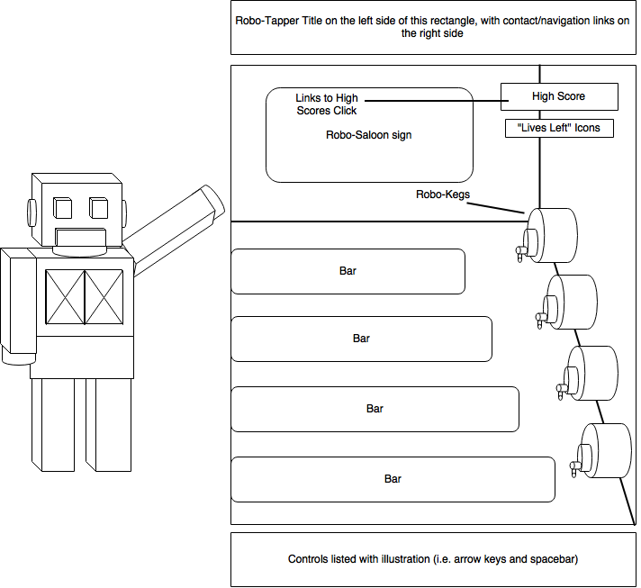

# Robo-Tapper

As the sole-proprietor of the local Robot Saloon, you'll have to work quickly to ensure that all your customers are served before their thirst overtakes them...and they overtake you!

## Background

Tapper is a classic arcade game released in 1983 by Bally Midway, which originally required players to serve beer to unruly customers, before being rebranded shortly thereafter to Root Beer Tapper in 1984, at which time the alcoholic drinks were substituted with Root Beer.

The goal of the game is to slide drinks down the bar to all customers, who in turn slide a little bit down toward the exit doors with each received drink, until all customers have been "served" out of the building, at which time the level is complete and a new level begins with a harder difficulty. Customers continue to move slightly closer to the front of the bar when not being served.

The player can lose the level by:

 - Allowing any customer to reach the front of the bar (as the unruly and unserved customer will dispose of the player)

 - Allowing any stein (which a served customer slides forward upon consuming) to reach the front of the bar without the player being there to catch it (as the stein will fall to the floor and break)

 - Serving a drink to a preoccupied customer (e.g. one who is already drinking) such that the full stein slides all the way to the back of the bar and slides off (as the stein will fall to the floor and break)

This implementation of Tapper, Robo-Tapper, will feature similar gameplay, but a futuristic theme, in which the player and customers are robots in a Robot Saloon.

## Functionality & MVP

In Robo-Tapper, users can:

  - Start a new game, reset the game, and view high scores

  - Continue onto harder difficulties upon completing a level

  - Continue the current level, even upon losing, until 3 "lives/tries" have been used, at which time the game will reset to the initial level

  - Serve drinks to robots

  - Clean up empty steins

  - Be assaulted by unruly customers who reach the front of the bar without being served

  - Break steins by either serving them prematurely or failing to catch them upon return

This project will also include:

  - Basic control instructions alongside the game window

  - Navigation links to my Github/Email/Linkedin accounts

  - A production Readme

##  Wireframes

This application will be comprised on a single screen and game board, in which any content changes will be displayed.

The title will be above the game board and accompanied by links to my Github/Email/Linkedin pages.

High scores will be available upon click on the "High Score" section on the top right of the screen, under which the icons representing remaining lives will be kept.

The illustration for the controls will be shown just underneath the game board, alongside the game Start and Reset buttons.

## Technologies Used

HTML 5 Canvas, Vanilla JavaScript, and the Create.js library will be used to implement this project.

## Implementation Timeline

Day 1: Create sprites and all required artwork, learn how to load images onto the game stage and how to animate them using either TweenJS or basic EaselJS

Day 2: Map animations to game controls and complete general page layout in terms of animation placement, loading screen, high-scores screen, etc.

Day 3: Implement collisions detection and game logic (i.e. fail states, point-scoring, and the difficulty curve)

Day 4: Test, style, and bug-fix as needed - implement sound effects if time permits

## Bonus features

With time permitting, I'd like to also pursue the following additions to this project:

  - Add mini-game between levels, as included in the originals

  - Add additional levels, as related to the graphical background rather than difficulty

  - Add an intro that emulates the boot-up style of the classic arcade machines on which these were originally run
